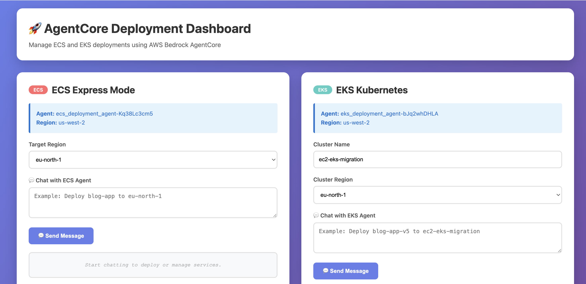
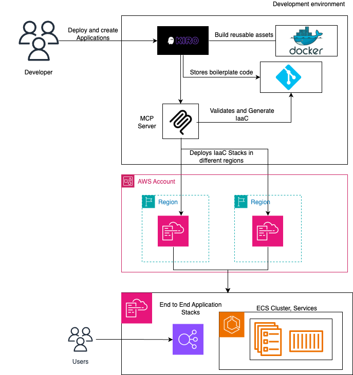
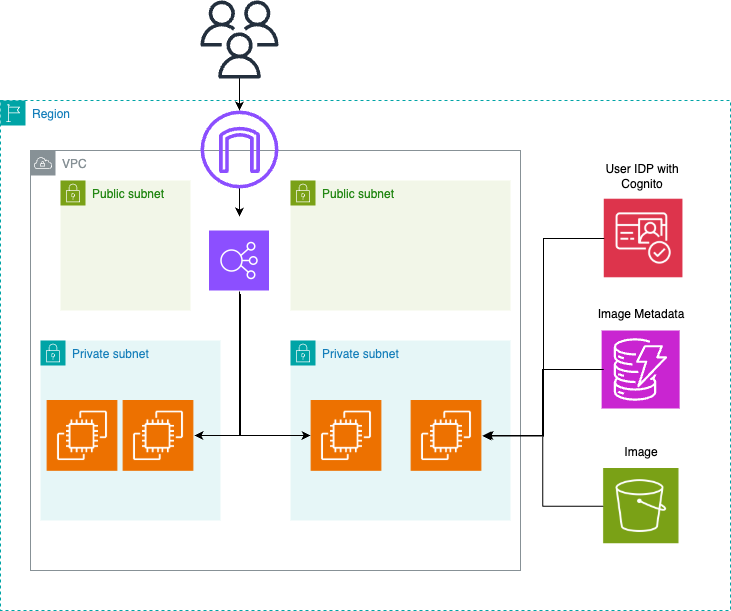

# Amazon EC2 to Amazon ECS Migration with AgentCore MCP Server

Automated deployment of containerized applications to AWS Amazon ECS Express Mode and EKS using **custom MCP agents** hosted on **Amazon Bedrock AgentCore** (AWS-managed runtime) with AI-powered natural language interface.



## 🎯 What's New

**Custom MCP Agents on AWS-Managed Runtime** - Your custom deployment agents run on Amazon Bedrock AgentCore's managed infrastructure, supporting multi-region deployments with full Amazon Cognito authentication and natural language commands.

**AI-Powered Web UI** - Chat interface for deploying applications using natural language. Just type "deploy my-app with 5 replicas" and let AI handle the rest.

## 🏗️ Architecture Overview

### What's AWS-Managed vs Custom?

| Component | Type | Description |
|-----------|------|-------------|
| **Amazon Bedrock AgentCore** | AWS-Managed | Serverless runtime that hosts your agents |
| **MCP Agents (Python code)** | Custom | Your deployment logic in `agentcore-*-runtime/` folders |
| **MCP Tools** | Custom | Python functions decorated with `@tool` |
| **Web UI** | Custom | Flask application in `web-ui/` |
| **LLM (Claude 3.5 Sonnet)** | AWS-Managed | Via Amazon Bedrock |

**In Simple Terms:**
- AWS provides the **infrastructure** (AgentCore runtime, Bedrock LLM)
- You provide the **logic** (MCP agents, tools, web UI)
- You deploy your custom agents to AWS-managed infrastructure

### Model Context Protocol (MCP) Integration



The solution uses MCP (Model Context Protocol) to connect AI models with deployment tools:
- **LLM Router**: Claude 3.5 Sonnet analyzes natural language commands
- **MCP Agents**: Expose deployment tools as standardized functions
- **Automated Workflows**: From Docker build to production deployment

### Amazon ECS Express Mode Deployment

ECS Express Mode simplifies container deployments:
- **No Cluster Management**: Automatic infrastructure provisioning
- **Built-in Load Balancer**: ALB included by default
- **Auto-scaling**: Configure min/max tasks with one parameter
- **80% Less Configuration**: Compared to traditional ECS

### Traditional Amazon EC2 Architecture (Before Migration)



The legacy Amazon EC2 setup this solution replaces:
- Manual server provisioning and configuration
- Complex deployment scripts
- Limited scalability
- Higher operational overhead

## 📁 Project Structure

```
ec2-ecs-express-mode-using-mcp/
├── agentcore-eks-runtime/              # ⭐ AgentCore EKS Agent (V2 - boto3 + k8s)
│   ├── agent.py                        # 5 MCP tools for EKS deployment
│   ├── add-eks-permissions.sh          # Add EKS/ECR/IAM permissions
│   ├── add-eks-cluster-access.sh       # Add role to EKS cluster
│   └── requirements.txt                # boto3, kubernetes, mcp
├── agentcore-agent-runtime/            # AgentCore Amazon ECS Agent
│   ├── agent.py                        # 5 MCP tools for Amazon ECS deployment
│   ├── update-permissions.sh           # Add Amazon ECS permissions
│   └── requirements.txt                # strands, boto3
├── infrastructure/
│   ├── cdk/                            # CDK Amazon EC2 infrastructure (reference)
│   └── rest-api-server/                # Legacy REST API (reference)
├── sample-application/                 # Demo Node.js blog app with Cognito
├── scripts/
│   ├── deployment/                     # Amazon EC2 deployment scripts
│   └── cleanup/                        # ⭐ Multi-region cleanup scripts
├── test-python-scripts/
│   ├── test_eks_conversation.py        # ⭐ EKS deployment test (V2 Agent)
│   ├── test_ecs_conversation.py        # Amazon ECS deployment test
│   ├── test_v2_agent.py                # ⭐ V2 Agent testing
│   ├── test_delete_eks_service_conversation.py  # ⭐ EKS delete test
│   ├── test_delete_ecs_service_conversation.py  # ⭐ Amazon ECS delete test
│   └── test_mcp_with_sigv4.py          # MCP SigV4 authentication test
└── README.md                           # This file
```

## 🔄 AgentCore Runtime Protocols

This project includes **two different AgentCore runtimes** with different protocols and invocation methods:

### 1. AgentCore EKS Runtime (V2 - MCP Protocol)
**Location:** `agentcore-eks-runtime/`

**Protocol:** Model Context Protocol (MCP) with FastMCP
- **Transport:** Streamable HTTP (SSE - Server-Sent Events)
- **Authentication:** AWS SigV4 signing
- **Invocation:** Direct HTTP POST to AgentCore endpoint
- **Dependencies:** `mcp`, `boto3`, `kubernetes`

**Invocation Example:**
```python
# MCP JSON-RPC 2.0 format
mcp_request = {
    "jsonrpc": "2.0",
    "id": 1,
    "method": "tools/call",
    "params": {
        "name": "deploy_to_eks_with_irsa",
        "arguments": {...}
    }
}

# POST to: https://bedrock-agentcore.{region}.amazonaws.com/runtimes/{agent_arn}/invocations
```

**Key Features:**
- Pure Python SDK implementation (boto3 + kubernetes client)
- No CLI dependencies (no AWS CLI, kubectl, Docker CLI needed in container)
- Stateless HTTP transport
- Real-time streaming responses via SSE

### 2. AgentCore Amazon ECS Runtime (Strands Protocol)
**Location:** `agentcore-agent-runtime/`

**Protocol:** Strands (AWS proprietary)
- **Transport:** HTTP with Strands-specific format
- **Authentication:** AWS SigV4 signing
- **Invocation:** Strands conversation API
- **Dependencies:** `strands`, `boto3`

**Invocation Example:**
```python
# Strands conversation format
from strands import Agent

agent = Agent(agent_id="...", region="...")
response = agent.invoke(
    action="deploy_ecs_express_service",
    parameters={...}
)
```

**Key Features:**
- Conversation-based interaction model
- Built-in state management
- Optimized for Amazon ECS deployments

### Protocol Comparison

| Feature | EKS Runtime (MCP) | Amazon ECS Runtime (Strands) |
|---------|-------------------|----------------------|
| Protocol | MCP (Open Standard) | Strands (AWS Proprietary) |
| Transport | SSE (Streamable HTTP) | HTTP |
| Format | JSON-RPC 2.0 | Strands-specific |
| Dependencies | mcp, boto3, kubernetes | strands, boto3 |
| CLI Tools | Not needed | Not needed |
| State | Stateless | Stateful conversations |
| Streaming | Yes (SSE) | No |

### When to Use Which?

**Use EKS Runtime (MCP)** when:
- Deploying to Kubernetes/EKS
- Need pure Python SDK implementation
- Want open standard protocol (MCP)
- Require real-time streaming responses

**Use Amazon ECS Runtime (Strands)** when:
- Deploying to Amazon ECS Express Mode
- Need conversation-based interactions
- Want AWS-optimized protocol
- Prefer stateful agent interactions

## 🚀 Quick Start - EKS Deployment

### Prerequisites Setup

Before deploying, ensure you have:
1. **AWS CLI** configured with appropriate credentials
2. **Docker** installed and running
3. **Python 3.10+** with required packages
4. **kubectl** configured for EKS access
5. **EKS Cluster** pre-configured and running (e.g., `ec2-eks-migration`)
6. **CDK infrastructure** deployed (for Amazon Cognito, Amazon DynamoDB, Amazon S3)

#### EKS Cluster Prerequisites

Your EKS cluster must be configured with:
- **Authentication Mode**: `API` (EKS Access Entries) or `API_AND_CONFIG_MAP`
- **OIDC Provider**: Associated with the cluster for IRSA support
- **Node Group**: At least one node group with sufficient capacity
- **VPC Configuration**: Proper networking and security groups

**Check your cluster:**
```bash
# Verify cluster exists
aws eks describe-cluster --name ec2-eks-migration --region eu-north-1

# Check authentication mode
aws eks describe-cluster --name ec2-eks-migration --region eu-north-1 \
  --query 'cluster.accessConfig.authenticationMode' --output text

# Update kubeconfig
aws eks update-kubeconfig --name ec2-eks-migration --region eu-north-1

# Verify kubectl access
kubectl get nodes
```

### 1. Deploy CDK Infrastructure (One-time)

```bash
cd infrastructure/cdk
npm install
npm run build
cdk deploy --region eu-north-1
```

This creates:
- Amazon Cognito User Pool and Client
- Amazon DynamoDB table (blog-posts)
- Amazon S3 bucket for images
- IAM roles

**Important:** After CDK deployment, update the following files with the new resource IDs:

```bash
# Get the outputs from CDK
aws cloudformation describe-stacks --stack-name CdkInfrastructureStack --region eu-north-1 \
  --query 'Stacks[0].Outputs' --output table

# Update these files:
# 1. sample-application/.env
# 2. test_conversation.py (env_vars section)
# 3. test_multi_task.py (env_vars section)
```

**Required values to update:**
- `COGNITO_USER_POOL_ID` (e.g., <COGNITO_USER_POOL_ID>)
- `COGNITO_CLIENT_ID` (e.g., <COGNITO_CLIENT_ID>)
- `Amazon S3_BUCKET` (e.g., blog-images-private-ACCOUNT-REGION)
- `DYNAMODB_TABLE` (e.g., blog-posts)

### 2. Deploy AgentCore EKS Agent

```bash
cd agentcore-eks-runtime

# Deploy to AWS (one-time)
agentcore launch

# Add EKS permissions to AgentCore role (auto-detects role and region)
bash add-eks-permissions.sh

# Or specify role and region explicitly
bash add-eks-permissions.sh AmazonBedrockAgentCoreSDKRuntime-us-west-2-XXXXX us-west-2

# Add AgentCore role to EKS cluster access (auto-detects role)
bash add-eks-cluster-access.sh ec2-eks-migration eu-north-1

# Or specify all parameters explicitly
bash add-eks-cluster-access.sh ec2-eks-migration eu-north-1 AmazonBedrockAgentCoreSDKRuntime-us-west-2-XXXXX

# Verify
agentcore status
```

**Output:** Agent ARN like `arn:aws:bedrock-agentcore:us-west-2:ACCOUNT:runtime/eks_deployment_agent-XXXXX`

**Important Scripts:**
- `add-eks-permissions.sh` - Adds EKS, ECR, IAM, CodeBuild permissions to AgentCore execution role
  - Usage: `./add-eks-permissions.sh [ROLE_NAME] [REGION]`
  - Auto-detects role if not specified
- `add-eks-cluster-access.sh` - Adds AgentCore role to EKS cluster with admin access
  - Usage: `./add-eks-cluster-access.sh CLUSTER_NAME [REGION] [ROLE_NAME]`
  - Auto-detects role if not specified

### 3. Build and Push Docker Image

```bash
cd sample-application

# Build image
docker build --platform linux/amd64 -t sample-application:latest .

# Login to ECR
aws ecr get-login-password --region eu-north-1 | \
  docker login --username AWS --password-stdin ACCOUNT.dkr.ecr.eu-north-1.amazonaws.com

# Create ECR repository
aws ecr create-repository --repository-name sample-application --region eu-north-1 || true

# Tag and push
docker tag sample-application:latest ACCOUNT.dkr.ecr.eu-north-1.amazonaws.com/sample-application:latest
docker push ACCOUNT.dkr.ecr.eu-north-1.amazonaws.com/sample-application:latest
```

### 4. Deploy Application to EKS

```bash
# Deploy to eu-north-1 (or any region)
python3 test-python-scripts/test_eks_conversation.py
```

This automatically:
1. ✅ Sets up OIDC provider for EKS
2. ✅ Creates IRSA role with Amazon S3/Amazon DynamoDB permissions
3. ✅ Builds and pushes Docker image to ECR
4. ✅ Deploys to EKS with service account
5. ✅ Creates LoadBalancer endpoint
6. ✅ Verifies deployment

### 5. Verify Deployment

```bash
# Check deployment status
kubectl get deployments -n default

# Check pods
kubectl get pods -l app=blog-app-eks-v3

# Get service endpoint
kubectl get service blog-app-eks-v3 -o jsonpath='{.status.loadBalancer.ingress[0].hostname}'
```

## 🔧 AgentCore MCP Tools (EKS V2 Agent)

| Tool | Purpose |
|------|---------|
| `setup_oidc_provider` | Setup OIDC identity provider for EKS |
| `create_irsa_role` | Create IAM role for service account (IRSA) |
| `build_image_with_codebuild` | Build Docker image using AWS CodeBuild |
| `deploy_to_eks_with_irsa` | Deploy application to EKS with IRSA |
| `get_deployment_status` | Check deployment status |
| `delete_eks_deployment` | Delete EKS deployment, service, and service account |

## 🔧 AgentCore Tools (Amazon ECS Agent)

| Tool | Purpose |
|------|---------|
| `create_ecr_repository` | Create ECR repository for container images |
| `deploy_ecs_express_service` | Deploy application to Amazon ECS Express Mode |
| `list_ecs_services` | List all Amazon ECS services across clusters |
| `check_service_status` | Check Amazon ECS service deployment status |
| `scale_service` | Scale Amazon ECS service to desired task count |
| `delete_ecs_service` | Delete Amazon ECS service and AWS CloudFormation stack |

## 📊 Architecture

```
AgentCore EKS Agent (AWS-managed)
    ↓
5 MCP Tools (boto3 + kubernetes client)
    ↓
ECR Repository + Container Image
    ↓
EKS Cluster + IRSA + LoadBalancer
    ↓
Running Application (1-N replicas)
```

## 🎯 Key Features

- **AgentCore EKS Agent**: AWS-managed runtime with boto3 + kubernetes client
- **5 Automated Tools**: Complete EKS deployment workflow
- **IRSA Support**: IAM Roles for Service Accounts
- **Multi-Replica Support**: Deploy 1-N replicas
- **Environment Variables**: Full Amazon Cognito + Amazon DynamoDB + Amazon S3 configuration
- **IAM Authentication**: Secure by default (SigV4)
- **CloudWatch Integration**: Full observability
- **Multi-Region**: Deploy to any AWS region
- **Production Ready**: Security hardened containers

## 📚 Documentation

Additional documentation available in the `docs/` directory.

## 🔑 Prerequisites

- **AWS CLI** configured with appropriate credentials
- **Python 3.10+** with boto3, kubernetes client
- **Docker** installed and running
- **kubectl** configured for EKS access
- **EKS Cluster** pre-configured (e.g., `ec2-eks-migration` in `eu-north-1`)
- **bedrock-agentcore-starter-toolkit** installed:
  ```bash
  pip install bedrock-agentcore-starter-toolkit
  ```

## 🏷️ Resource Tagging

All resources tagged with:
- `Project: EKS-Express-Migration`
- `ManagedBy: AgentCore`
- `Environment: Demo`

## 📋 Testing

```bash
# Test V2 agent deployment
python3 test-python-scripts/test_eks_conversation.py

# Test V2 agent tools
python3 test-python-scripts/test_v2_agent.py

# Test MCP authentication
python3 test-python-scripts/test_mcp_with_sigv4.py

# Verify deployment
kubectl get deployments,services,pods -n default
aws eks describe-cluster --name ec2-eks-migration --region eu-north-1
```

## 🧹 Cleanup

```bash
# Delete Kubernetes resources
kubectl delete deployment,service,serviceaccount blog-app-eks-v3

# Delete ECR repository
aws ecr delete-repository --repository-name blog-app-eks-v3 --region eu-north-1 --force

# Delete IRSA role
aws iam delete-role-policy --role-name blog-app-eks-v3-irsa-role --policy-name blog-app-eks-v3-permissions
aws iam delete-role --role-name blog-app-eks-v3-irsa-role
```

## 🔐 Security

This project follows AWS security recommended practices and the [AWS Shared Responsibility Model](https://aws.amazon.com/compliance/shared-responsibility-model/).

### Security Features
- ✅ Non-root container execution
- ✅ Health checks for automatic recovery
- ✅ IAM roles for service accounts (IRSA)
- ✅ Least privilege IAM policies
- ✅ Encryption at rest (Amazon S3, Amazon DynamoDB)
- ✅ TLS/HTTPS enforcement
- ✅ Block Public Access for Amazon S3
- ✅ CloudTrail logging enabled
- ✅ No hardcoded credentials

### Customer Security Responsibilities
You are responsible for:
- Configuring IAM policies and roles
- Enabling encryption for Amazon S3 and Amazon DynamoDB
- Securing API endpoints with authentication
- Managing credentials using AWS Secrets Manager
- Regular security reviews and access audits
- Application code security and vulnerability scanning

## 📖 Learn More

- **AgentCore**: https://docs.aws.amazon.com/bedrock-agentcore/latest/devguide/
- **Amazon ECS**: https://docs.aws.amazon.com/AmazonECS/latest/userguide/
- **Amazon EKS**: https://docs.aws.amazon.com/eks/latest/userguide/
- **IRSA**: https://docs.aws.amazon.com/eks/latest/userguide/iam-roles-for-service-accounts.html
- **MCP Protocol**: https://modelcontextprotocol.io/
- **AWS Security Best Practices**: https://aws.amazon.com/architecture/security-identity-compliance/

---

**Status:** ✅ Production ready with AgentCore EKS V2 Agent (boto3 + kubernetes client)

**Legal**: © 2026 Amazon Web Services, Inc. or its affiliates. All rights reserved.
