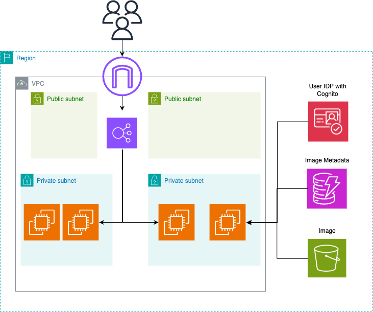
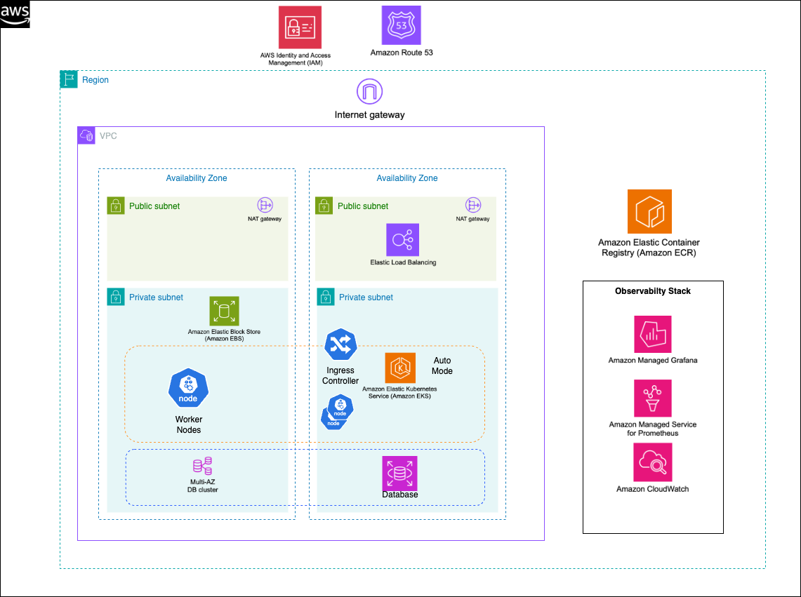

# Amazon EC2 Migration to Containers using Kiro CLI and MCP Servers

Automated migration of EC2 applications to containerized deployments on **Amazon ECS Express Mode** or **Amazon EKS Auto Mode** using Kiro CLI and MCP servers.

## 📝 Blog Walkthroughs

This repository supports two blog posts. Start with the one matching your target:

| Blog | Target | Key Files |
|------|--------|-----------|
| [EC2 to ECS Express Mode](https://aws.amazon.com/blogs/containers/migrate-amazon-ec2-to-ecs-express-mode-using-kiro-cli-and-mcp-servers/) | ECS Express Mode (Fargate) | `kiro/mcp.json` |
| [EC2 to EKS Auto Mode](https://aws.amazon.com/blogs/containers/migrate-amazon-ec2-to-eks-auto-mode-using-kiro-cli-and-mcp-servers/) | EKS Auto Mode (Kubernetes) | `.kiro/skills/ec2-to-eks-auto-mode/`, `.kiro/agents/eks-migration.json` |

Both blogs use the same sample Node.js application and initial EC2 infrastructure.

## 🏗️ Architecture Overview

### Initial Architecture (EC2)



Traditional VM deployment: Node.js app on EC2 behind ALB, with Amazon Cognito authentication, Amazon S3 for images, and Amazon DynamoDB for metadata. Deployed via AWS CDK.

### Target Architectures

**EKS Auto Mode** — Managed Kubernetes with automatic node provisioning, scaling, and patching.




## 📁 Project Structure

```
├── .kiro/
│   ├── agents/eks-migration.json       # Kiro agent config for EKS blog (MCP servers)
│   └── skills/ec2-to-eks-auto-mode/    # 7-phase EKS migration skill
├── kiro/
│   └── mcp.json                        # Kiro MCP config for ECS blog
├── sample-application/                 # Node.js blog app (used by both blogs)
│   ├── Dockerfile
│   ├── src/server.js
│   └── public/index.html
├── infrastructure/
│   ├── cdk/                            # CDK stack for initial EC2 deployment
│   └── eks-auto-mode/                  # CDK stack for EKS Auto Mode cluster
├── scripts/
│   ├── deployment/deploy.sh            # Deploy initial EC2 app
│   ├── deployment/deploy_eks_cluster.sh # Deploy EKS cluster (alternative to skill)
│   └── cleanup/legacy_destroy.sh       # Remove EC2 infrastructure
└── docs/
    ├── ENV_SETUP.md
    └── diagrams/
```

## 🚀 Quick Start

### Prerequisites

- [AWS CLI](https://docs.aws.amazon.com/cli/latest/userguide/getting-started-install.html) 2.15.0+
- [Kiro CLI](https://kiro.dev/docs/cli/) 1.25.0+
- [AWS CDK v2](https://docs.aws.amazon.com/cdk/v2/guide/getting-started.html) 2.238.0+
- [Node.js](https://nodejs.org/) 20+
- [Docker](https://www.docker.com/) or [Finch](https://github.com/runfinch/finch)
- [kubectl](https://kubernetes.io/docs/tasks/tools/) (EKS blog only)

### Step 1: Deploy the Initial EC2 Application

```bash
git clone https://github.com/aws-samples/sample-ec2-migrations-to-ecs-express-mode-using-kiro-cli-and-mcp-server
cd sample-ec2-migrations-to-ecs-express-mode-using-kiro-cli-and-mcp-server

cd infrastructure/cdk && npm install && cd ../..
./scripts/deployment/deploy.sh <your-region>
```

### Step 2: Follow Your Target Blog

**For ECS Express Mode:**
```bash
kiro-cli
```
Then follow [the ECS blog](https://aws.amazon.com/blogs/containers/migrate-amazon-ec2-to-ecs-express-mode-using-kiro-cli-and-mcp-servers/) from Step 3 onwards.

**For EKS Auto Mode:**
```bash
kiro-cli chat --agent eks-migration
```
Then follow the EKS blog's migration prompt.

## 🧹 Clean Up

### ECS Express Mode
Use Kiro CLI to delete the ECS service, or run `cdk destroy` in the infrastructure directory.

### EKS Auto Mode
```bash
# Via Kiro CLI (uses manage_eks_stacks MCP tool)
# Or manually:
cd infrastructure/eks-auto-mode && cdk destroy
```

### EC2 Infrastructure (both blogs)
```bash
./scripts/cleanup/legacy_destroy.sh <your-region>
```

## 🔐 Security

See [CONTRIBUTING](CONTRIBUTING.md) for security issue reporting. This project follows [AWS Shared Responsibility Model](https://aws.amazon.com/compliance/shared-responsibility-model/) best practices:

- Non-root container execution
- IAM least-privilege policies
- Health checks for automatic recovery
- No hardcoded credentials

## 📖 Learn More

- [Amazon ECS Express Mode](https://docs.aws.amazon.com/AmazonECS/latest/developerguide/express-service-overview.html)
- [Amazon EKS Auto Mode](https://docs.aws.amazon.com/eks/latest/userguide/automode.html)
- [AWS MCP Server](https://docs.aws.amazon.com/aws-mcp/latest/userguide/what-is-mcp-server.html)
- [ECS MCP Server](https://awslabs.github.io/mcp/servers/ecs-mcp-server)
- [EKS MCP Server](https://awslabs.github.io/mcp/servers/eks-mcp-server)
- [Kiro CLI](https://kiro.dev/cli/)

---

© 2026 Amazon Web Services, Inc. or its affiliates. All rights reserved.
